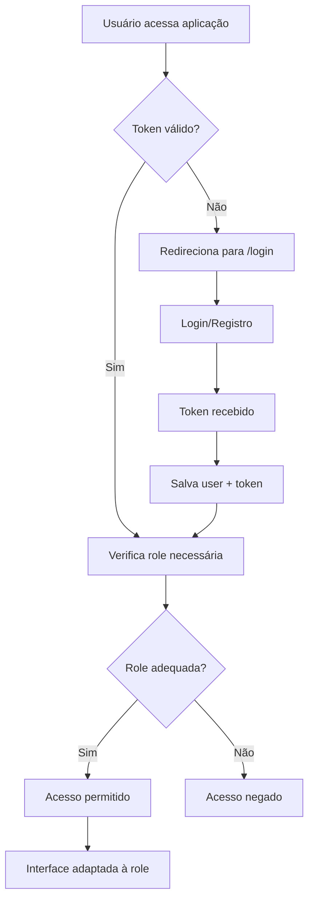

# Sistema de Roles - GoMech Frontend

Este documento descreve o sistema de controle de acesso baseado em roles implementado no frontend do sistema GoMech.

## 📋 Visão Geral

O sistema implementa dois níveis de acesso:
- **USER**: Acesso somente leitura (visualização)
- **ADMIN**: Acesso completo (criar, editar, excluir, visualizar)

## 🔑 Usuários Padrão (Para Testes)

- **admin@gomech.com** / **admin123** (ADMIN)
- **user@gomech.com** / **user123** (USER)

## 🏗️ Arquitetura Implementada

### 1. Context de Autenticação (`src/context/AuthContext.tsx`)

```typescript
interface User {
  id: number;
  email: string;
  role: 'USER' | 'ADMIN';
}
```

**Hooks disponíveis:**
- `useAuth()`: Acesso ao contexto de autenticação
- `useRole()`: Funções específicas para verificação de permissões

### 2. Componentes de Proteção

#### ProtectedRoute (`src/components/ProtectedRoute/ProtectedRoute.tsx`)
Protege rotas inteiras baseado em autenticação e roles específicos.

```tsx
<ProtectedRoute requiredRole="ADMIN">
  <AdminPage />
</ProtectedRoute>
```

#### RoleGuard (`src/components/RoleGuard/RoleGuard.tsx`)
Renderização condicional baseada em roles.

```tsx
<RoleGuard roles={['ADMIN']}>
  <Button>Excluir</Button>
</RoleGuard>
```

#### AuthRoute (`src/components/AuthRoute/AuthRoute.tsx`)
Protege páginas de login/registro, redirecionando usuários já autenticados.

### 3. Serviço de API (`src/services/api.ts`)

**Interceptadores implementados:**
- **Request**: Adiciona token JWT automaticamente
- **Response**: Trata erros 401 (token inválido) e 403 (sem permissão)

```typescript
// Uso do serviço
await apiService.clients.getAll();
await apiService.clients.create(data);
```

## 🛡️ Permissões por Role

### USER (Usuário Comum)
- ✅ Visualizar clientes
- ✅ Visualizar veículos  
- ✅ Visualizar ordens de serviço
- ❌ Criar registros
- ❌ Editar registros
- ❌ Excluir registros
- ❌ Acessar administração

### ADMIN (Administrador)
- ✅ Todas as permissões do USER
- ✅ Criar registros
- ✅ Editar registros
- ✅ Excluir registros
- ✅ Acessar administração
- ✅ Gerenciar configurações

## 🖥️ Interface do Usuário

### Dashboard
- Mostra informações do usuário logado
- Exibe permissões atuais visualmente
- Seções específicas por role

### Sidebar
- Informações do usuário e role
- Menu de administração (apenas ADMIN)
- Logout para todos os usuários

### Tabelas (Clientes, Veículos, OS)
- Botão "Visualizar": Disponível para todos
- Botões "Editar" e "Excluir": Apenas ADMIN

### Topbar
- Botão "Nova [Entidade]": Apenas ADMIN

## 🚀 Como Usar

### 1. Verificar Permissões em Componentes

```typescript
// Hook useRole
const { canCreate, canEdit, canDelete, isAdmin } = useRole();

// Renderização condicional
{canEdit() && <EditButton />}
```

### 2. Proteger Rotas

```typescript
// Rota protegida por autenticação
<ProtectedRoute>
  <ClientsPage />
</ProtectedRoute>

// Rota protegida por role específico
<ProtectedRoute requiredRole="ADMIN">
  <AdminPage />
</ProtectedRoute>
```

### 3. Renderização Condicional

```typescript
// Mostrar apenas para ADMINs
<RoleGuard roles={['ADMIN']}>
  <AdminButton />
</RoleGuard>

// Mostrar para ambos os roles
<RoleGuard roles={['USER', 'ADMIN']}>
  <ViewButton />
</RoleGuard>
```

## 🔄 Fluxo de Autenticação



## 🔍 Tratamento de Erros

### Interceptadores de API

```typescript
// 401 - Token inválido/expirado
→ Remove token + user do localStorage
→ Redireciona para /login

// 403 - Sem permissão
→ Exibe alerta "Você não tem permissão"
→ Mantém usuário na página atual
```

### Validações Frontend

```typescript
// Verificação antes de ações
if (!canDelete()) {
  alert('Você não tem permissão para excluir');
  return;
}
```

## 📱 Páginas Implementadas

### Protegidas por Autenticação
- `/` - Dashboard
- `/clientes` - Lista de clientes
- `/veiculos` - Lista de veículos
- `/os` - Ordens de serviço

### Protegidas por Role ADMIN
- `/admin` - Painel administrativo

### Páginas Públicas (com AuthRoute)
- `/login` - Login
- `/register` - Registro

## 🧪 Como Testar

### 1. Teste como USER
```bash
# Login: user@gomech.com / user123
# Verificar:
- ❌ Botões de criar/editar/excluir não aparecem
- ❌ Menu "Administração" não aparece
- ✅ Pode visualizar todas as listas
- ❌ Não pode acessar /admin
```

### 2. Teste como ADMIN
```bash
# Login: admin@gomech.com / admin123
# Verificar:
- ✅ Todos os botões aparecem
- ✅ Menu "Administração" aparece
- ✅ Pode acessar /admin
- ✅ Todas as funcionalidades disponíveis
```

### 3. Teste de Segurança
```bash
# Como USER, tentar:
- Acessar /admin diretamente → Deve mostrar "Acesso negado"
- F12 > Remover display:none de botões → API deve retornar 403
```

## 📦 Arquivos Principais

```
src/
├── context/
│   └── AuthContext.tsx          # Context + hooks de auth/roles
├── components/
│   ├── ProtectedRoute/          # Proteção de rotas
│   ├── RoleGuard/               # Renderização condicional
│   └── AuthRoute/               # Proteção de auth pages
├── services/
│   └── api.ts                   # Interceptadores + API calls
└── pages/
    ├── login.tsx                # Login
    ├── register.tsx             # Registro
    └── admin/
        └── index.tsx            # Painel admin
```

## 🔧 Configuração

### Variáveis de Ambiente (se necessário)
```env
NEXT_PUBLIC_API_URL=http://localhost:5080/api
```

### Backend Requirements
- API deve retornar role no login/register
- Endpoints devem validar permissões
- JWT deve conter informações de role

## 📝 Próximos Passos

- [ ] Implementar testes unitários
- [ ] Adicionar mais roles (MANAGER, etc.)
- [ ] Sistema de notificações para erros 403
- [ ] Cache de permissões
- [ ] Logs de auditoria frontend

---

**Sistema implementado seguindo as melhores práticas de segurança e UX** 🔐 